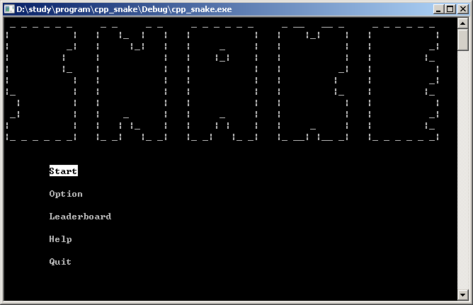
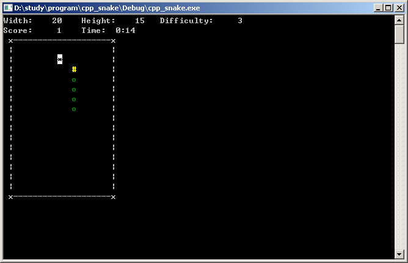
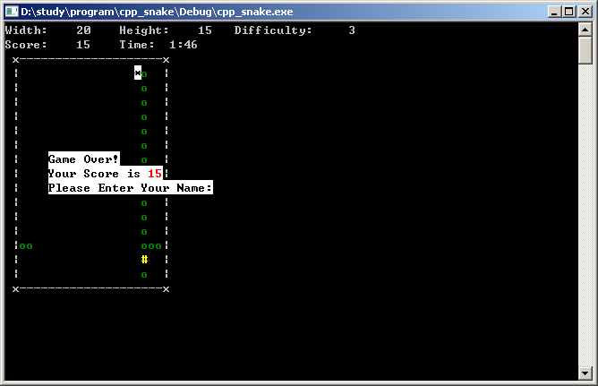
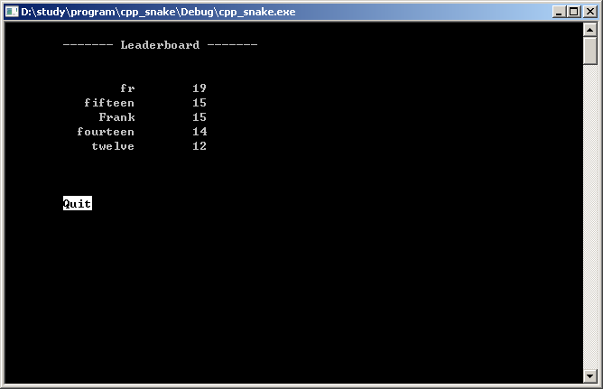
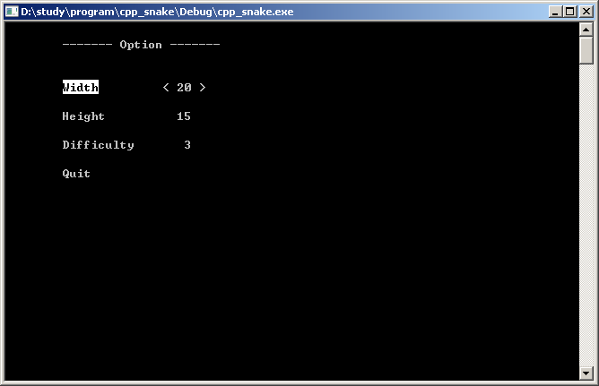
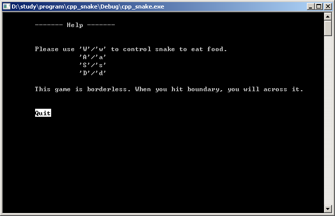

# 貪吃蛇

[Demo 影片請點此](https://drive.google.com/file/d/1dE4vyt3Dug-zHK9gOp9O1BzkOOUThM3j/view?usp=sharing)

經典的貪吃蛇遊戲。

## 開始畫面

使用 W/w (上)、 A/a (左)、 S/s (下)、 D/d (右)與 Enter 鍵來控制。選單有五個選項， Start 是開始遊戲， Option 是遊戲設置， Leaderboard 是排行榜， Help 是遊戲說明， Quit 是離開遊戲。

## 遊戲畫面

上方顯示遊戲的設定，畫面的寬 (Width) 、高 (Height) ，遊戲難度 (Difficulty) ，目前得分 (Score) ，遊戲時間 (Time) 。中間則是遊戲區塊，黃色的「#」是我們的蛇頭，綠色的「o」是蛇身，白底黑字的「*」是食物，我們要控制蛇去吃掉食物，並且不能撞到自己的蛇身。

## 遊戲結束畫面

當蛇身填滿整個畫面，或是蛇頭撞到蛇身，就會結束遊戲，同時會跳出訊息告知我們的得分，並且要我們輸入名字，然後會將分數儲存至 Leaderboard 內。

## 排行榜畫面

可以在 Leaderboard 內看到目前最高分的五位玩家，並顯示每位玩家的名字與分數。

## 遊戲設置畫面

Option 內可以更改三個遊戲設定，分別是畫面寬度、高度與遊戲難度。

## 遊戲說明畫面

Help 內有遊戲說明與控制方法。

